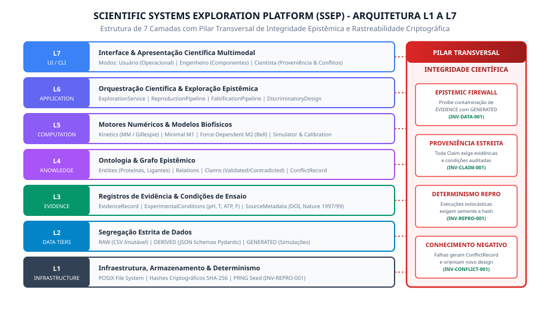

# Molecular Cell Research - Scientific Systems Exploration Platform (SSEP)

Plataforma de engenharia de conhecimento científico e biofísica computacional dedicada à integração formal de evidências empíricas, rastreabilidade criptográfica de proveniência, representação rigorosa de incertezas, modelagem mecanomolecular e desenho experimental discriminatório.

**Repositório Remoto:** `https://github.com/walbarellos/molecular-cell-research`  
**Metodologia:** Engenharia em Cascata Estrita (Ciclos 00 a 09)  
**Governança:** Epistemic Firewall Transversal (INV-DATA-001) e Rastreabilidade SHA-256  

---

## 1. Visão Geral da Arquitetura (L1 a L7)



A plataforma estrutura-se em 7 camadas modulares com separação unidirecional de dependências e um pilar transversal de integridade científica:

```
[L7 PRESENTATION]     CLI Tri-modal: Usuário (Operacional) │ Engenheiro (Componentes) │ Cientista (Proveniência)
      │
[L6 APPLICATION]      ExplorationService │ ReproductionPipeline │ FalsificationPipeline │ DiscriminatorEngine
      │
[L5 COMPUTATION]      Kinetics (Michaelis-Menten / Gillespie) │ Model M1 (Quimioestático) │ Model M2 (Bell/Kramers)
      │
[L4 KNOWLEDGE]        Grafo Epistêmico: Biological Entities │ Physical Relations │ Claims │ ConflictRecords
      │
[L3 EVIDENCE]         EvidenceRecords (Medições ± Incertezas) │ ExperimentalConditions │ SourceMetadata (DOI)
      │
[L2 DATA TIERS]       Segregação Estrita: [TIER::RAW] (CSV) │ [TIER::DERIVED] (JSON) │ [TIER::GENERATED] (Simulações)
      │
[L1 INFRASTRUCTURE]   Sistema POSIX │ Checksums Criptográficos SHA-256 │ Semente PRNG Determinística
```

---

## 2. Estrutura Canônica da Documentação (`docs/`)

Toda a documentação do projeto está padronizada e indexada em diretórios numerados:

* **[`docs/00-cascata/`](file:///home/walbarellos/Projects/microbiology-cell/docs/00-cascata/)**:
  * `00.00 - Notas Originais do Usuario.txt`: Requisitos originais do usuário e visão conceitual.
  * `00.01 - Manifesto e Metodologia Cascata.md`: Princípios de integridade epistêmica e filosofia de engenharia.
  * `00.02 - Roadmap dos Ciclos 00 a 09.md`: Histórico de planejamento e entregas dos 10 ciclos cascata.
* **[`docs/01-diagramas/`](file:///home/walbarellos/Projects/microbiology-cell/docs/01-diagramas/)**:
  * `01.01 - Arquitetura de Camadas L1 a L7.md`: Diagrama vetorial e especificações estruturais de L1 a L7.
  * `01.02 - Pipeline de Dados e Epistemic Firewall.md`: Fluxo e barreiras de contenção (`RAW` $\to$ `DERIVED` $\to$ `GENERATED`).
  * `01.03 - Grafo de Entidades e Relacoes.md`: Topologia ontológica do complexo KIF5B, microtúbulo e nucleotídeos.
  * `01.04 - Maquina de Estados Epistemica.md`: Ciclo de vida de conhecimento, falsificação e *Negative Knowledge*.
* **[`docs/02-arquitetura/`](file:///home/walbarellos/Projects/microbiology-cell/docs/02-arquitetura/)**:
  * `02.01 - Especificacao de Arquitetura SSEP v0.1.md`: Requisitos RF/RNF, contratos L1-L7 e os 15 objetos normativos.
* **[`docs/03-dados/`](file:///home/walbarellos/Projects/microbiology-cell/docs/03-dados/)**:
  * `03.01 - Curadoria de Datasets CELL-LAB-001.md`: Curadoria e QC de Dataset A (calibração) e Dataset B (falsificação).
* **[`docs/04-modelos/`](file:///home/walbarellos/Projects/microbiology-cell/docs/04-modelos/)**:
  * `04.01 - Especificacao do Modelo Minimo KIF5B.md`: Modelo cinético analítico, ciclo mecanoquímico e Gillespie.
* **[`docs/05-relatorios/`](file:///home/walbarellos/Projects/microbiology-cell/docs/05-relatorios/)**:
  * `05.01 - Relatorio de Reproducao Dataset A.md`: Benchmark de reprodução sem carga ($R^2 = 0.9955$, $\chi^2_{\text{red}} = 0.778$).
  * `05.02 - Relatorio de Falsificacao Dataset B.md`: Quebra preditiva sob carga ($z = -49.8\sigma$ no stall force).
  * `05.03 - Desenho Experimental Discriminatorio.md`: Proposta ótima de ensaio com $100\%$ de poder de resolução ($> 20\sigma$).
* **[`docs/06-interfaces/`](file:///home/walbarellos/Projects/microbiology-cell/docs/06-interfaces/)**:
  * `06.01 - Guia da Interface e CLI L7.md`: Manual operacional detalhado dos três modos de visualização.

---

## 3. Ativos Visuais e Vetoriais (`docs/assets/icons/`)

* [`architecture_layers_l1_l7.svg`](file:///home/walbarellos/Projects/microbiology-cell/docs/assets/icons/architecture_layers_l1_l7.svg): Arquitetura completa L1-L7 com o pilar transversal de integridade.
* [`epistemic_firewall.svg`](file:///home/walbarellos/Projects/microbiology-cell/docs/assets/icons/epistemic_firewall.svg): Isolamento de dados observados vs. sintéticos.
* [`epistemic_state_transitions.svg`](file:///home/walbarellos/Projects/microbiology-cell/docs/assets/icons/epistemic_state_transitions.svg): Máquina de estados de propagação epistêmica.
* [`kinesin_motor.svg`](file:///home/walbarellos/Projects/microbiology-cell/docs/assets/icons/kinesin_motor.svg): Estrutura biofísica do dímero de Cinesina-1 sobre protofilamento de microtúbulo.
* [`kinesin_mechanochemical_cycle.svg`](file:///home/walbarellos/Projects/microbiology-cell/docs/assets/icons/kinesin_mechanochemical_cycle.svg): Ciclo mecanoquímico de 4 estados e ancoramento do *neck-linker*.
* [`conflict_divergence.svg`](file:///home/walbarellos/Projects/microbiology-cell/docs/assets/icons/conflict_divergence.svg): Curvas de confronto força-velocidade e divergência estatística de $49.8\sigma$.
* [`discriminatory_power.svg`](file:///home/walbarellos/Projects/microbiology-cell/docs/assets/icons/discriminatory_power.svg): Espaço de desenho experimental discriminatório entre modelos concorrentes.

---

## 4. Como Executar a Interface CLI (L7)

O ponto de entrada CLI encontra-se em [`presentation/cli/main.py`](file:///home/walbarellos/Projects/microbiology-cell/presentation/cli/main.py):

```bash
# 1. Resumo epistêmico do grafo de conhecimento
.venv/bin/python presentation/cli/main.py status

# 2. Modo Usuário: Simulação com proteção do Epistemic Firewall
.venv/bin/python presentation/cli/main.py user --atp 1000 --load 0
.venv/bin/python presentation/cli/main.py user --atp 1000 --load 4.0  # Alerta de quebra de modelo

# 3. Modo Engenheiro: Inspeção de entidades, parâmetros e sensibilidade
.venv/bin/python presentation/cli/main.py engineer

# 4. Modo Científico: Premissas, trilha de proveniência e conflitos
.venv/bin/python presentation/cli/main.py scientist

# 5. Execução dos Pipelines de Reprodução e Falsificação
.venv/bin/python presentation/cli/main.py run-reproduction
.venv/bin/python presentation/cli/main.py run-falsification

# 6. Proposta de Desenho Experimental Discriminatório (Ciclo 09)
.venv/bin/python presentation/cli/main.py design-experiment
```

---

## 5. Central de Administração e Gerenciamento em Camadas

Para simplificar a operação, manutenção e auditoria do sistema, foram disponibilizados três mecanismos unificados de controle:

### Opção A: Script Executável Unificado (`./cell-ctl`)
```bash
./cell-ctl status            # Resumo do grafo epistêmico
./cell-ctl user              # Modo Usuário (regime validado, F = 0 pN)
./cell-ctl user --load 4.0   # Modo Usuário (alerta Epistemic Firewall sob carga)
./cell-ctl engineer          # Modo Engenheiro (componentes, entidades e parâmetros)
./cell-ctl scientist         # Modo Científico (proveniência e conflitos formais)
./cell-ctl design            # Desenho Experimental Discriminatório (Ciclo 09)
./cell-ctl reproduce         # Executa ciclo de reprodução (Dataset A)
./cell-ctl falsify           # Executa ciclo de falsificação (Dataset B)
./cell-ctl test              # Executa suíte de testes (pytest)
./cell-ctl verify            # Auditoria formal completa de dados, schemas e invariantes
./cell-ctl demo              # Bateria completa pedagógica de demonstração (L1 a L7)
```

### Opção B: Central Python (`manage.py`)
```bash
python manage.py status
python manage.py user --preset-valid
python manage.py user --preset-falsified
python manage.py engineer
python manage.py scientist
python manage.py design
python manage.py demo
python manage.py verify
```

### Opção C: Automação via `make`
```bash
make status
make user
make user-falsified
make engineer
make scientist
make design
make test
make verify
make demo
```

---

## 6. Como Executar os Testes Automatizados

A suíte de testes do pytest verifica a integridade de todas as camadas, cobrindo validações de esquemas JSON, inviolabilidade de invariantes epistêmicas, controle de qualidade de dados brutos e cálculos biofísicos:

```bash
./cell-ctl test
# ou: .venv/bin/pytest -v
```

*Status:* **29 testes automatizados aprovados (100% de sucesso).**
