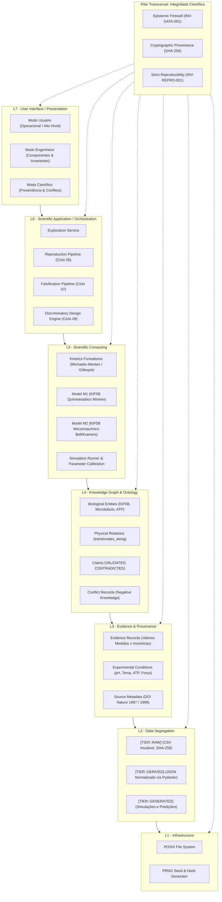

# Arquitetura de Camadas L1 a L7 e Governança Epistêmica

---

### 1. Representação Gráfica da Arquitetura

---

### 2. Especificação Estrutural das Camadas

A **Scientific Systems Exploration Platform (SSEP)** adota uma arquitetura em 7 camadas rigorosamente segregadas, ancoradas por um pilar transversal permanente de **Integridade Epistêmica**:

| Camada | Denominação | Escopo Técnico | Principais Componentes e Modelos | Invariantes Associadas |
|---|---|---|---|---|
| **L7** | **User Interface / Presentation** | Apresentação científica multimodal com firewall ativo | CLI tri-modal (`user`, `engineer`, `scientist`), ViewModels | `INV-UI-001` (marcação explícita de Tier em toda exibição) |
| **L6** | **Scientific Application** | Orquestração de ensaios, reprodução e falsificação | `ExplorationService`, `ReproductionPipeline`, `FalsificationPipeline`, `DiscriminatorEngine` | `INV-REPRO-001` (garantia de determinismo estocástico) |
| **L5** | **Scientific Computing** | Motores matemáticos e modelos biofísicos | Formalismo cinético (Michaelis-Menten, Gillespie), Modelos M1 (`MOD-KIF5B-MINIMAL-MM`) e M2 (`MOD-KIF5B-4STATE-FORCE-DEPENDENT`) | `INV-MODEL-001` (declaração formal de premissas e sensibilidade) |
| **L4** | **Knowledge Graph & Ontology** | Grafo epistêmico e registro de alegações formais | `Entity`, `Relation`, `Claim` (`VALIDATED`, `CONTRADICTED`), `ConflictRecord` | `INV-CLAIM-001`, `INV-CONFLICT-001` |
| **L3** | **Evidence & Provenance** | Observações empíricas auditadas e rastreáveis | `EvidenceRecord`, `ExperimentalConditions`, `SourceMetadata` | `INV-EVIDENCE-001` (vínculo obrigatório com fonte externa) |
| **L2** | **Data Segregation** | Isolamento estrito de tiers de armazenamento | `RAW` (CSV imutável), `DERIVED` (JSON Schema tipado), `GENERATED` (Simulação) | `INV-DATA-001` (barreira intransponível de tiers) |
| **L1** | **Infrastructure** | Armazenamento de arquivos, integridade de hash e PRNG | Sistema de arquivos POSIX, Hashes SHA-256, Semente pseudoaleatória | `INV-STORAGE-001` (imutabilidade de dados primários) |

---

### 3. Pilar Transversal de Integridade Científica

O pilar transversal atua interceptando interações entre todas as camadas do sistema:

1. **Epistemic Firewall (INV-DATA-001):**
   * Impede formalmente que dados sintéticos ou predições de modelos (`GENERATED`) sejam gravados ou referenciados como evidência empírica (`EVIDENCE`).
   * A interface de usuário (L7) é obrigada a exibir o carimbo de tier em cada medição ou parâmetro.

2. **Rastreabilidade Criptográfica (SHA-256):**
   * Cada arquivo no tier `RAW` possui checksum imutável verificado na inicialização do sistema. Qualquer divergência invalida a cadeia de evidências.

3. **Registro de Conhecimento Negativo (Popperian Falsification):**
   * Falhas de predição estatisticamente significativas ($|z| > 2.0\sigma$) geram automaticamente instâncias de `ConflictRecord` e claims de status `CONTRADICTED`.
   * Modelos falhos não são descartados silenciosamente; seu domínio de falha é registrado formalmente para orientar novos desenhos experimentais discriminatórios (L6).

---

### 4. Diagrama de Fluxo e Dependência de Componentes

