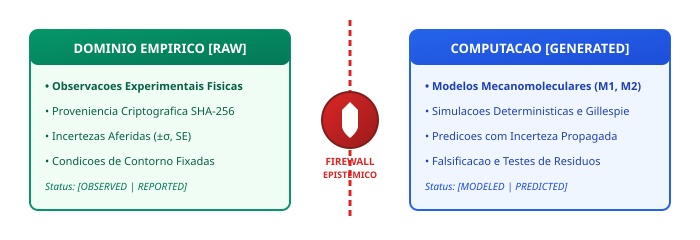
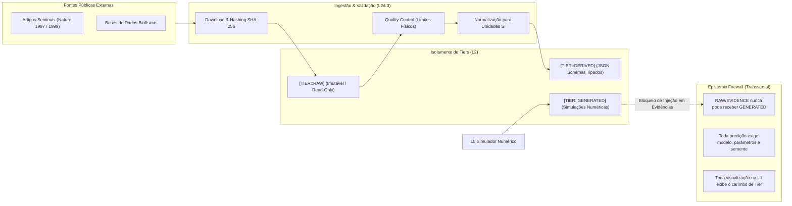

# Pipeline de Dados e Epistemic Firewall (L2 / L3)

---

### 1. Representação Gráfica do Firewall Epistêmico



---

### 2. Normas de Segregação de Dados (INV-DATA-001)

A integridade epistêmica da plataforma depende da separação estrita e irreversível entre dados empíricos observados e predições computacionais:

```
[Mundo Físico / Ensaios]
          │
          ▼
   [TIER::RAW]           (Arquivos CSV imutáveis em data/raw/, com hash SHA-256)
          │
     (Ingestão, QC, Normalização de Unidades SI)
          ▼
  [TIER::DERIVED]        (Modelos Pydantic em data/derived/, schemas JSON validados)
          │
          ├──────────────────────────────────────────────┐
          │ (Fornece Condições de Contorno e Parâmetros) │
          ▼                                              ▼
   [L5 COMPUTAÇÃO]                               [EPISTEMIC FIREWALL]
          │                                              ▲
          ▼                                              │ (BLOQUEIA retroalimentação
   [TIER::GENERATED]     ────────────────────────────────┘  de dados gerados para evidências)
   (Simulações, Predições)
```

---

### 3. Regras Invioláveis do Epistemic Firewall

1. **Bloqueio de Contaminação Sintética:**
   * É estritamente proibido que instâncias de `EvidenceRecord` (L3) referenciem objetos provenientes do tier `GENERATED` (L2/L5).
   * Evidências empíricas devem obrigatoriamente possuir uma fonte física ou bibliográfica verificável (`source_id`), métodos de medição documentados e incertezas quantificadas ($\sigma$).

2. **Auditoria Criptográfica de Hashes:**
   * Cada arquivo no tier `RAW` possui checksum SHA-256 registrado no manifesto de ingestão ([`data/derived/cell_lab_001/manifest_cell_lab_001.json`](file:///home/walbarellos/Projects/microbiology-cell/data/derived/cell_lab_001/manifest_cell_lab_001.json)).
   * Qualquer alteração de byte em dados brutos gera falha imediata na inicialização do sistema.

3. **Carimbo Epistêmico Obrigatório:**
   * Nenhum dado pode ser renderizado para a interface de usuário (L7) ou consumido por orquestradores (L6) sem o carimbo formal de sua origem (`[TIER::RAW]`, `[TIER::DERIVED]` ou `[TIER::GENERATED]`) e seu status epistêmico (`OBSERVED`, `DERIVED`, `MODELED`, `PREDICTED`, `VALIDATED`, `CONTRADICTED`).

---

### 4. Diagrama de Fluxo Mermaid


