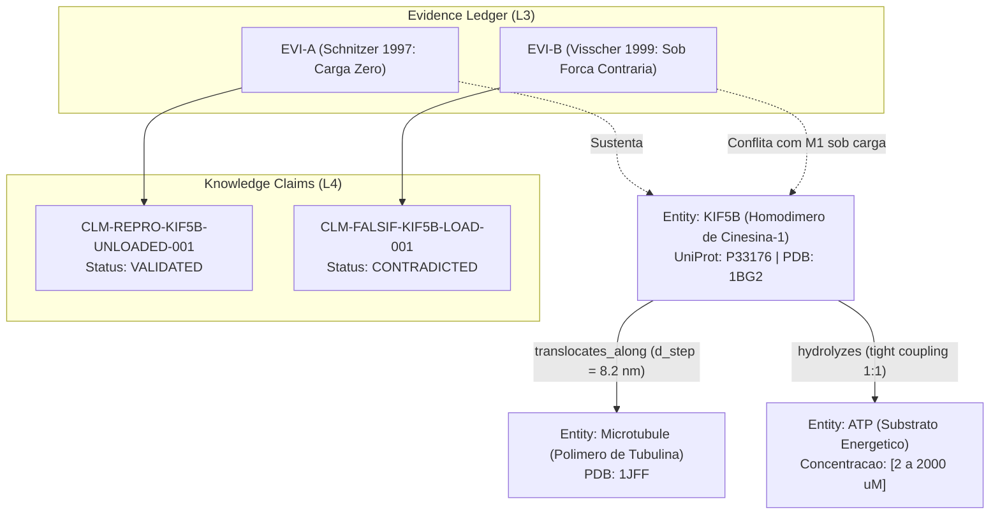

# Diagrama do Grafo de Entidades e Relacoes (L4)

```mermaid
graph TD
    KIF5B["Entity: KIF5B (Homodimero de Cinesina-1)\nUniProt: P33176 | PDB: 1BG2"]
    MT["Entity: Microtubule (Polimero de Tubulina)\nPDB: 1JFF"]
    ATP["Entity: ATP (Substrato Energetico)\nConcentracao: [2 a 2000 uM]"]

    KIF5B -- "translocates_along (d_step = 8.2 nm)" --> MT
    KIF5B -- "hydrolyzes (tight coupling 1:1)" --> ATP

    subgraph Evidences ["Evidence Ledger (L3)"]
        EVI_A["EVI-A (Schnitzer 1997: Carga Zero)"]
        EVI_B["EVI-B (Visscher 1999: Sob Forca Contraria)"]
    end

    EVI_A -. Sustenta .-> KIF5B
    EVI_B -. Conflita com M1 sob carga .-> KIF5B

    subgraph Claims ["Knowledge Claims (L4)"]
        CLM1["CLM-REPRO-KIF5B-UNLOADED-001\nStatus: VALIDATED"]
        CLM2["CLM-FALSIF-KIF5B-LOAD-001\nStatus: CONTRADICTED"]
    end

    EVI_A --> CLM1
    EVI_B --> CLM2
```
