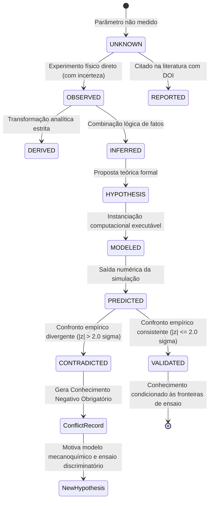

# Máquina de Estados Epistêmica e Conhecimento Negativo

---

### 1. Representação Gráfica da Máquina de Estados

---

### 2. Taxonomia dos Estados Epistêmicos

Cada dado, parâmetro, predição e afirmação no sistema transita por estados bem definidos:

| Estado Epistêmico | Tier Típico | Critério de Entrada | Invariantes Aplicadas | Exemplo Prático |
|---|---|---|---|---|
| `UNKNOWN` | Qualquer | Parâmetro ainda não medido ou sem fonte atribuída | Não pode ser usado em simulações definitivas | Constante elástica do dímero antes de calibração |
| `OBSERVED` | `RAW` / `DERIVED` | Medição física empírica direta com protocolo documentado | Exige `source_id`, incerteza $\sigma$ e hash verificado | Velocidade de $0.814 \pm 0.040 \ \mu\text{m/s}$ em 1000 µM ATP |
| `REPORTED` | `DERIVED` | Valor citado na literatura sem dados primários locais | Requer citação de DOI formal | Razão estequiométrica ATP/passo = 1.0 (Schnitzer 1997) |
| `DERIVED` | `DERIVED` | Obtenção via cálculo analítico estrito a partir de dados observados | Não introduz premissas biológicas adicionais | $k_{cat} = V_{max} / d_{\text{step}}$ com propagação de incerteza |
| `HYPOTHESIS` | Teórico | Proposição formal falsificável sobre um mecanismo biológico | Deve especificar condições excludentes | "Carga contrária modula a taxa catalítica exponencialmente via barreira de Bell" |
| `MODELED` | `COMPUTATION` | Implementação matemática executável de uma hipótese | Requer lista explícita de premissas e sensibilidades | Classe `KinesinMinimalModel` (`MOD-KIF5B-MINIMAL-MM`) |
| `PREDICTED` | `GENERATED` | Saída numérica gerada por uma simulação sob condições dadas | Requer hash da simulação e semente PRNG | $v_{\text{pred}} = 0.7784 \ \mu\text{m/s}$ sob $[\text{ATP}] = 1000 \ \mu\text{M}$ |
| `VALIDATED` | Conhecimento | Predição consistente com evidências empíricas ($|z| \le 2.0\sigma$) | Validade estritamente circunscrita às condições testadas | `CLM-REPRO-KIF5B-UNLOADED-001` sob $F_{\text{load}} = 0.0 \text{ pN}$ |
| `CONTRADICTED` | Conhecimento | Predição divergente das evidências empíricas ($|z| > 2.0\sigma$) | **Obriga** a criação de `ConflictRecord` (Negative Knowledge) | `CLM-FALSIF-KIF5B-LOAD-001` sob $F_{\text{load}} = 6.0 \text{ pN}$ ($z = -49.8\sigma$) |

---

### 3. Princípio de Falsificação Popperiana e Conhecimento Negativo

A integridade do sistema não reside em "provar que uma teoria está certa", mas em:
1. **Identificar onde o modelo quebra:** A refutação empírica com escore $|z| > 2.0\sigma$ não é um erro do software, mas uma descoberta científica.
2. **Registro de Negative Knowledge:** O estado `CONTRADICTED` gera um `ConflictRecord` que documenta formalmente qual premissa falhou.
3. **Retroalimentação para o Desenho Experimental:** O conflito delimita a fronteira do modelo e alimenta o motor de **Desenho Experimental Discriminatório (Ciclo 09)**, selecionando ensaios na região de máxima incerteza.

---

### 4. Diagrama Mermaid de Transições

