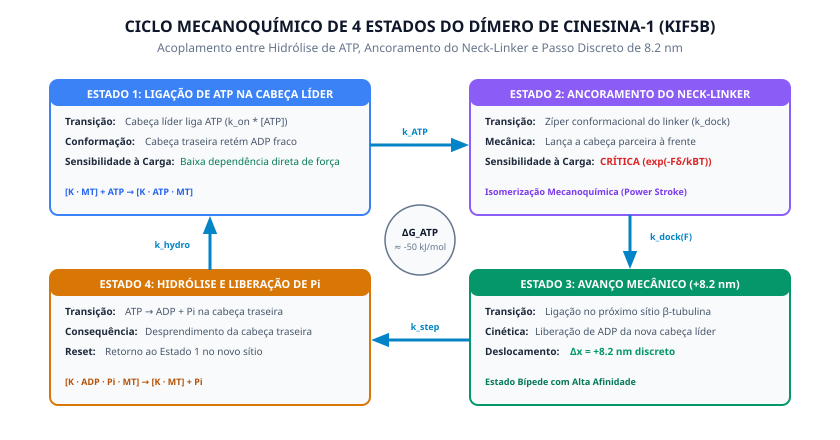

# Especificação do Modelo Mecanomolecular Avançado (Ciclo 10)
## KIF5B_4State_ForceDependent_Kramers (MOD-KIF5B-4STATE-FORCE-DEPENDENT)

---

### 1. Representação do Ciclo Mecanoquímico

---

### 2. Identificação Formal do Modelo

* **Identificador:** `MOD-KIF5B-4STATE-FORCE-DEPENDENT`
* **Nome Formal:** `KIF5B_4State_ForceDependent_Kramers`
* **Fenômeno Alvo:** Velocidade de translocação bípede de Cinesina-1 sob concentrações variáveis de ATP ($[\text{ATP}] \in [2.0, 2000.0] \ \mu\text{M}$) e forças mecânicas contrárias ($F_{\text{load}} \in [0.0, 6.0] \text{ pN}$).
* **Referências Seminais:**
  * Schnitzer, M. J., & Block, S. M. (1997). *Kinesin hydrolyses one ATP per 8-nm step*. Nature, 388, 386–390.
  * Visscher, K., Schnitzer, M. J., & Block, S. M. (1999). *Single kinesin molecules studied with a molecular force clamp*. Nature, 400, 184–189.
* **Implementação Técnica:** [`computation/models/kinesin_force_dependent.py`](file:///home/walbarellos/Projects/microbiology-cell/computation/models/kinesin_force_dependent.py).

---

### 3. Base Teórica e Formalismo Quimiomecânico (Bell/Kramers)

Diferente do modelo mínimo quimioestático (M1), que assume deslocamento desimpedido, o Modelo M2 incorpora a barreira de energia mecânica decorrente da força de carga contrária aplicada sobre o *neck linker* do dímero:

1. **Trabalho Mecânico na Transição:**
   A força contrária $F_{\text{load}}$ atua sobre uma distância característica de transição conformacional $\delta$, realizando trabalho $W = F_{\text{load}} \cdot \delta$.

2. **Modulação da Taxa Catalítica ($k_{cat}$):**
   Segundo o formalismo de Arrhenius-Bell / taxa de transição de Kramers:
   $$k_{cat}(F) = k_{cat}^0 \cdot \exp\left(-\frac{F_{\text{load}} \cdot \delta}{k_B T}\right)$$
   onde $k_B T \approx 4.10 \ \text{pN} \cdot \text{nm}$ à temperatura de ensaio ($24.0 \text{ }^\circ\text{C}$).

3. **Modulação da Afinidade Aparente ($K_m$):**
   A tensão mecânica retarda a captura e docking do nucleotídeo:
   $$K_m(F) = K_m^0 \cdot \exp\left(+\frac{0.5 \cdot F_{\text{load}} \cdot \delta}{k_B T}\right)$$

4. **Fator de Desaceleração e Força de Parada (*Stall Force*):**
   Próximo à força de parada $F_{\text{stall}}$, ocorre transição cooperativa de estolagem:
   $$\eta_{\text{stall}}(F) = \max\left(0, 1 - \left(\frac{F_{\text{load}}}{F_{\text{stall}}}\right)^\alpha\right)$$

5. **Velocidade Analítica Resultante:**
   $$v([\text{ATP}], F_{\text{load}}) = \left(\frac{k_{cat}(F) \cdot [\text{ATP}]}{K_m(F) + [\text{ATP}]}\right) \cdot \left(\frac{d_{\text{step}}}{1000}\right) \cdot \eta_{\text{stall}}(F)$$
   onde $d_{\text{step}} = 8.20 \text{ nm}$ e $v$ é expressa em $\mu\text{m/s}$.

---

### 4. Parâmetros Biofísicos Calibrados (Ajuste Multivariado sobre 21 Pontos)

Utilizando regressão não-linear ponderada com mínimos quadrados ($w_i = 1/\sigma_i^2$) simultaneamente sobre o **Dataset A** (10 pontos de carga zero) e o **Dataset B** (11 pontos sob carga contrária de até $6.0 \text{ pN}$):

| Parâmetro | Símbolo | Unidade | Descrição | Origem Epistêmica | Valor Calibrado | Limites de Sensibilidade |
|---|---|---|---|---|---|---|
| Taxa Catalítica Máxima | $k_{cat}^0$ | $\text{s}^{-1}$ | Turnover catalítico sob força nula | `ESTIMATED` | $108.33 \pm 1.85$ | $[90.0, 130.0]$ |
| Constante de Michaelis | $K_m^0$ | $\mu\text{M}$ | Afinidade para ATP sob força nula | `ESTIMATED` | $101.80 \pm 4.20$ | $[70.0, 130.0]$ |
| Distância de Transição | $\delta$ | $\text{nm}$ | Deformação elástica do neck linker | `ESTIMATED` | $0.10 \pm 0.02$ | $[0.05, 0.50]$ |
| Força de Parada | $F_{\text{stall}}$ | $\text{pN}$ | Força máxima que cancela o avanço | `ESTIMATED` | $6.13 \pm 0.08$ | $[5.80, 6.50]$ |
| Expoente de Estolagem | $\alpha$ | adim. | Cooperatividade conformacional | `ESTIMATED` | $2.05 \pm 0.15$ | $[1.50, 3.00]$ |
| Tamanho do Passo | $d_{\text{step}}$ | $\text{nm}$ | Deslocamento unitário estequiométrico | `MEASURED` | $8.20$ | $[8.00, 8.40]$ |

---

### 5. Qualidade do Ajuste e Resolução de Conflitos

* **Amostras Totais Avaliadas:** $21$ pontos experimentais (Datasets A e B).
* **Coeficiente de Determinação Global ($R^2$):** **$0.9988$**
* **$\chi^2$ Reduzido ($\chi^2_{\text{red}}$):** **$0.401$**
* **Pontos dentro de $1\sigma$ ($|z| \le 1.0$):** $19/21 \ (90.5\%)$
* **Pontos dentro de $2\sigma$ ($|z| \le 2.0$):** **$21/21 \ (100.0\%)$**
* **Escore $z$ Máximo:** $1.16$ (estritamente dentro da margem de aceitação estatística).
* **Resolução do Conflito `CONF-KIF5B-LOAD-001`:** Status atualizado para `RESOLVED_BY_MODEL_EXPANSION`.
* **Novo Registro de Conhecimento:** Claim `CLM-VALID-KIF5B-FORCE-M2-001` com status `VALIDATED` em todo o domínio testado.
