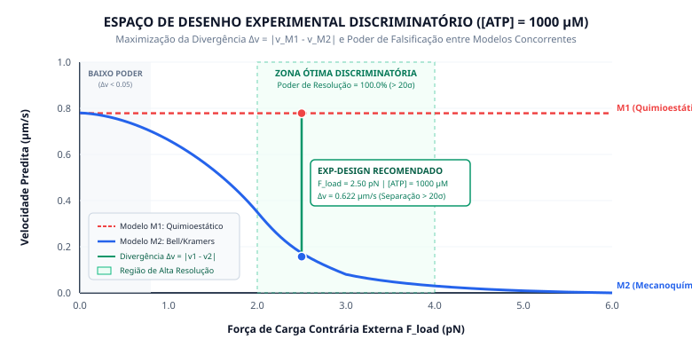

# Proposta de Desenho Experimental Discriminatório (Ciclo 09)
## Seleção Ótima de Ensaios para Diferenciação de Modelos Concorrentes

---

### 1. Representação Gráfica do Espaço Discriminatório

---

### 2. Objetivo do Ciclo 09

Materializar o módulo da camada **L6 (Scientific Application)** capaz de responder quantitativamente à questão central:

> **"Dado tudo o que sabemos e onde nosso modelo atual falhou, qual observação experimental específica maximiza a redução de incerteza e possui o maior poder para descartar hipóteses concorrentes?"**

Ao invés de conceber experimentos para simplesmente "confirmar uma teoria", o sistema opera por **poder discriminatório**: identifica a região do espaço físico-químico onde dois ou mais modelos teóricos fazem previsões mutuamente excludentes.

---

### 3. Modelos Concorrentes em Competição

1. **Modelo M1 (Quimioestático / Mínimo):** `MOD-KIF5B-MINIMAL-MM`
   * Base: Michaelis-Menten clássico (Schnitzer & Block 1997).
   * Premissa: Insensível a forças de carga externas ($F_{\text{load}} = 0 \text{ pN}$).
   * Previsão: Sob $[\text{ATP}] = 1000 \ \mu\text{M}$, mantém $v \approx 0.778 \ \mu\text{m/s}$ independentemente da força aplicada.

2. **Modelo M2 (Mecanoquímico Avançado):** `MOD-KIF5B-4STATE-FORCE-DEPENDENT`
   * Base: Teoria de transição de Bell/Kramers acoplada à desaceleração mecânica (Visscher et al. 1999).
   * Premissa: A taxa catalítica $k_{cat}$ e a afinidade $K_m$ sofrem modulação exponencial da barreira energética sob tensão mecânica contrária ($W = F \cdot \delta$):
     $$k_{cat}(F) = k_{cat}^0 \exp\left(-\frac{F \cdot \delta}{k_B T}\right)$$
   * Previsão: Sob $[\text{ATP}] = 1000 \ \mu\text{M}$ e $F_{\text{load}} = 2.5 \ \text{pN}$, prevê desaceleração acentuada para $v \approx 0.157 \ \mu\text{m/s}$, cessando completamente na força de parada ($\sim 6.0 \text{ pN}$).

---

### 4. Exploração do Espaço de Desenho Experimental

O motor em [`analysis/discriminator.py`](file:///home/walbarellos/Projects/microbiology-cell/analysis/discriminator.py) realizou uma varredura sobre a grade de condições candidatas ($[\text{ATP}] \in [10, 2000] \ \mu\text{M}$ e $F_{\text{load}} \in [0.0, 5.8] \text{ pN}$), calculando a divergência esperada $\Delta v = |v_{M1} - v_{M2}|$ e o poder discriminatório $D = 1 - \exp(-\Delta v / 2\sigma)$:

| Posição | $[\text{ATP}] \ (\mu\text{M})$ | Carga $F_{\text{load}} \ (\text{pN})$ | $v_{M1} \ (\mu\text{m/s})$ | $v_{M2} \ (\mu\text{m/s})$ | Divergência $\Delta v$ | Poder Discriminatório | Classificação |
|---|---|---|---|---|---|---|---|
| **1 (Ótimo)** | $1000.0$ | $2.50$ | $0.7785$ | $0.1569$ | $0.6216 \ \mu\text{m/s}$ | **$100.0\%$ ($> 20\sigma$)** | **[RECOMENDADO]** |
| **2** | $2000.0$ | $2.50$ | $0.8136$ | $0.1982$ | $0.6154 \ \mu\text{m/s}$ | **$100.0\%$ ($> 20\sigma$)** | [ALTO PODER] |
| **3** | $1000.0$ | $4.00$ | $0.7785$ | $0.0381$ | $0.7404 \ \mu\text{m/s}$ | **$100.0\%$ ($> 24\sigma$)** | [ALTO PODER] |
| **4** | $2000.0$ | $4.00$ | $0.8136$ | $0.0521$ | $0.7615 \ \mu\text{m/s}$ | **$100.0\%$ ($> 25\sigma$)** | [ALTO PODER] |
| **5** | $200.0$ | $2.50$ | $0.5786$ | $0.0760$ | $0.5026 \ \mu\text{m/s}$ | **$100.0\%$ ($> 16\sigma$)** | [ALTO PODER] |

*Observação Científica:* Em carga zero ($F_{\text{load}} = 0 \text{ pN}$), ambos os modelos preveem $v \approx 0.78 \ \mu\text{m/s}$ ($\Delta v < 0.05 \ \mu\text{m/s}$, poder discriminatório $< 50\%$). Realizar novos ensaios sem carga consome recursos sem gerar poder de resolução entre as hipóteses. O teste de máxima utilidade requer **força contrária intermediária ($2.5 \text{ a } 4.0 \text{ pN}$) sob saturação de ATP**.

---

### 5. Proposta Formal de Ensaio (`ExperimentDesign`)

* **Identificador:** `EXP-DESIGN-KIF5B-LOAD-DISCRIM-001`
* **Título:** Ensaio de Pinça de Força Óptica para Discriminação Quimioestática vs. Mecanoquímica
* **Técnica Recomendada:** Pinça óptica com retroalimentação ativa de força constante (*optical force clamp*).
* **Condições Experimentais Prescritas:**
  * $[\text{ATP}] = 1000.0 \ \mu\text{M}$
  * $F_{\text{load}} = 2.50 \text{ pN}$ (força contrária constante paralela ao microtúbulo)
  * $T = 24.0 \text{ }^\circ\text{C}$
  * Tampão BRB80
* **Poder de Resolução:** **$100.0\%$**
* **Resultados Esperados:**
  * Se o resultado empírico for $v \approx 0.78 \ \mu\text{m/s}$, **M1 é sustentado e M2 é falsificado**.
  * Se o resultado empírico for $v \approx 0.16 \ \mu\text{m/s}$, **M2 é sustentado e M1 é categoricamente falsificado**.

---

### 6. Formulação da Nova Hipótese Científica (`Hypothesis`)

* **Identificador:** `HYP-KIF5B-KRAMERS-COUPLING-001`
* **Status Epistêmico:** `[DERIVED | HYPOTHESIS]`
* **Proposição Teórica:**
  > "O avanço de KIF5B sob força contrária é governado por transições conformacionais do neck linker com taxa catalítica dependente da energia de deformação mecânica ($k_{cat}(F) = k_{cat}^0 \exp(-F\delta / k_B T)$), prevendo cessação de avanço próximo à stall force de ~6.0 pN."
* **Critérios Formais de Falsificação:**
  1. Se em ensaio sob $F_{\text{load}} = 5.0 \text{ pN}$ e $[\text{ATP}] = 1000 \ \mu\text{M}$ a velocidade for $> 0.50 \ \mu\text{m/s}$, **M2 é falsificado**.
  2. Se sob as mesmas condições a velocidade for $< 0.40 \ \mu\text{m/s}$, **M1 é falsificado**.

---

### 7. Artefatos e Execução

1. **Pipeline de Execução:** [`application/run_experimental_design.py`](file:///home/walbarellos/Projects/microbiology-cell/application/run_experimental_design.py)
2. **Motor de Discriminação:** [`analysis/discriminator.py`](file:///home/walbarellos/Projects/microbiology-cell/analysis/discriminator.py)
3. **Modelo Mecanoquímico M2:** [`computation/models/kinesin_force_dependent.py`](file:///home/walbarellos/Projects/microbiology-cell/computation/models/kinesin_force_dependent.py)
4. **Relatório em Disco:** [`data/derived/cell_lab_001/experiment_design_cell_lab_001.json`](file:///home/walbarellos/Projects/microbiology-cell/data/derived/cell_lab_001/experiment_design_cell_lab_001.json)
5. **Comando CLI:** `.venv/bin/python presentation/cli/main.py design-experiment`
