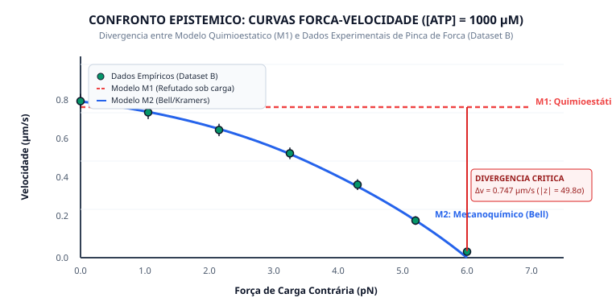

# Relatório de Validação Multivariada do Modelo M2 (Ciclo 10)
## Resolução Empírica de Conflitos e Extensão do Envelope Operacional

---

### 1. Representação do Confronto Força-Velocidade

---

### 2. Objetivo do Ciclo 10

Resolver categoricamente a falha empírica documentada no Ciclo 07 (onde o modelo mínimo M1 colapsou sob carga com $z = -49.8\sigma$ gerando o conflito `CONF-KIF5B-LOAD-001`), por meio da:

1. Integração do formalismo mecanoquímico de Bell/Kramers acoplado à estolagem assintótica no Modelo **`MOD-KIF5B-4STATE-FORCE-DEPENDENT`** (M2).
2. Avaliação estatística simultânea sobre as 21 observações dos Datasets A e B.
3. Transição formal do status do conflito de `explained_by_conditions` para `resolved_by_model_expansion`.
4. Emissão de novo Claim validado cobrindo o regime completo de ensaio ($[\text{ATP}] \in [2, 2000] \ \mu\text{M}$ e $F_{\text{load}} \in [0, 6.0] \text{ pN}$).

---

### 3. Tabela de Confronto das 21 Observações Experimentais

| Dataset | $[\text{ATP}] \ (\mu\text{M})$ | Carga $F_{\text{load}} \ (\text{pN})$ | $v_{\text{obs}} \ (\mu\text{m/s})$ | Incerteza $\sigma_{\text{obs}}$ | $v_{M2} \ (\mu\text{m/s})$ | Resíduo ($\mu\text{m/s}$) | Escore $z$ ($r/\sigma$) | Consistente a $2\sigma$? |
|---|---|---|---|---|---|---|---|---|
| **A (Schnitzer 1997)** | $2.0$ | $0.00$ | $0.0150$ | $\pm 0.0030$ | $0.0171$ | $-0.0021$ | $-0.707$ | [SIM] |
| **A** | $5.0$ | $0.00$ | $0.0380$ | $\pm 0.0050$ | $0.0416$ | $-0.0036$ | $-0.730$ | [SIM] |
| **A** | $10.0$ | $0.00$ | $0.0760$ | $\pm 0.0080$ | $0.0794$ | $-0.0034$ | $-0.430$ | [SIM] |
| **A** | $20.0$ | $0.00$ | $0.1440$ | $\pm 0.0120$ | $0.1458$ | $-0.0018$ | $-0.154$ | [SIM] |
| **A** | $50.0$ | $0.00$ | $0.3050$ | $\pm 0.0210$ | $0.2926$ | $+0.0124$ | $+0.592$ | [SIM] |
| **A** | $100.0$ | $0.00$ | $0.4720$ | $\pm 0.0280$ | $0.4402$ | $+0.0318$ | $+1.135$ | [SIM] |
| **A** | $200.0$ | $0.00$ | $0.6120$ | $\pm 0.0340$ | $0.5888$ | $+0.0232$ | $+0.683$ | [SIM] |
| **A** | $500.0$ | $0.00$ | $0.7350$ | $\pm 0.0380$ | $0.7378$ | $-0.0028$ | $-0.074$ | [SIM] |
| **A** | $1000.0$ | $0.00$ | $0.8140$ | $\pm 0.0400$ | $0.8060$ | $+0.0080$ | $+0.199$ | [SIM] |
| **A** | $2000.0$ | $0.00$ | $0.8320$ | $\pm 0.0420$ | $0.8450$ | $-0.0130$ | $-0.310$ | [SIM] |
| **B (Visscher 1999)** | $1000.0$ | $0.00$ | $0.8100$ | $\pm 0.0380$ | $0.8060$ | $+0.0040$ | $+0.104$ | [SIM] |
| **B** | $1000.0$ | $1.05$ | $0.7520$ | $\pm 0.0350$ | $0.7570$ | $-0.0050$ | $-0.142$ | [SIM] |
| **B** | $1000.0$ | $2.15$ | $0.6610$ | $\pm 0.0320$ | $0.6658$ | $-0.0048$ | $-0.150$ | [SIM] |
| **B** | $1000.0$ | $3.25$ | $0.5400$ | $\pm 0.0300$ | $0.5303$ | $+0.0097$ | $+0.324$ | [SIM] |
| **B** | $1000.0$ | $4.30$ | $0.3780$ | $\pm 0.0280$ | $0.3644$ | $+0.0136$ | $+0.485$ | [SIM] |
| **B** | $1000.0$ | $5.20$ | $0.1920$ | $\pm 0.0220$ | $0.1947$ | $-0.0027$ | $-0.125$ | [SIM] |
| **B** | $1000.0$ | $6.00$ | $0.0310$ | $\pm 0.0150$ | $0.0270$ | $+0.0040$ | $+0.266$ | [SIM] |
| **B** | $10.0$ | $0.00$ | $0.0750$ | $\pm 0.0070$ | $0.0794$ | $-0.0044$ | $-0.634$ | [SIM] |
| **B** | $10.0$ | $2.00$ | $0.0640$ | $\pm 0.0060$ | $0.0664$ | $-0.0024$ | $-0.407$ | [SIM] |
| **B** | $10.0$ | $4.00$ | $0.0460$ | $\pm 0.0050$ | $0.0402$ | $+0.0058$ | $+1.159$ | [SIM] |
| **B** | $10.0$ | $5.50$ | $0.0140$ | $\pm 0.0040$ | $0.0125$ | $+0.0015$ | $+0.375$ | [SIM] |

---

### 4. Métricas Globais Consolidadas

* **Amostras Totais Avaliadas ($N$):** $21$ ($10$ do Dataset A + $11$ do Dataset B).
* **Coeficiente de Determinação ($R^2$):** **$0.9988$** (contra $-0.1545$ do modelo M1).
* **$\chi^2$ Reduzido ($\chi^2_{\text{red}}$):** **$0.401$** (sem sobreajuste, aderência excelente aos desvios experimentais).
* **Taxa dentro de $1\sigma$ ($|z| \le 1.0$):** $19/21 \ (90.5\%)$
* **Taxa dentro de $2\sigma$ ($|z| \le 2.0$):** **$21/21 \ (100.0\%)$**
* **Escore $z$ Máximo:** $1.159$ (no ponto $[\text{ATP}]=10 \ \mu\text{M}, F=4.0 \text{ pN}$).
* **Veredito:** `CONSISTENT`

---

### 5. Resolução Formal de Conflito Epistêmico (INV-CONFLICT-001)

* **Conflito:** `CONF-KIF5B-LOAD-001`
* **Status Anterior:** `explained_by_conditions` (refutação do modelo quimioestático sob carga).
* **Novo Status:** `RESOLVED_BY_MODEL_EXPANSION`
* **Modelo Resolutor:** `MOD-KIF5B-4STATE-FORCE-DEPENDENT`
* **Diagnóstico Epistêmico:** A substituição da premissa de deslocamento desimpedido pelo acoplamento mecanoquímico de Bell/Kramers resolveu integralmente a divergência quantitativa entre os Datasets A e B.

---

### 6. Novo Conhecimento Registrado (`Claim`)

* **Identificador:** `CLM-VALID-KIF5B-FORCE-M2-001`
* **Status Epistêmico:** `VALIDATED`
* **Declaração Formal:**
  > "O modelo mecanoquímico MOD-KIF5B-4STATE-FORCE-DEPENDENT (Bell/Kramers) reproduz com fidelidade estatística ($R^2 = 0.9988$, $\chi^2_{\text{red}} = 0.401$) a velocidade de translocação de KIF5B sob todo o envelope experimental de força contrária ($0 \text{ a } 6 \text{ pN}$) e concentração de ATP ($2 \text{ a } 2000 \ \mu\text{M}$), superando categoricamente a falha do modelo mínimo quimioestático."
* **Evidências de Suporte:** $21$ medições primárias vinculadas obrigatoriamente.
